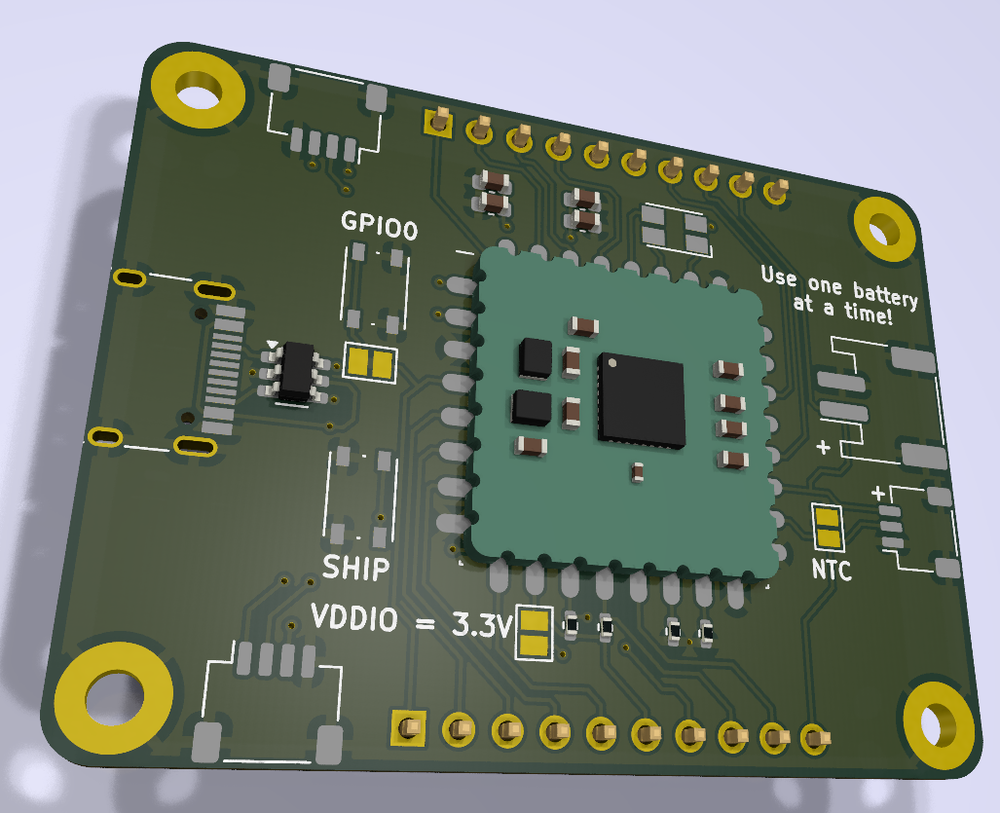

# nPM1300 Stamp Carrier Board

  

## Overview

Companion carrier board for the nPM1300 Stamp, providing additional functionality and connectivity options. Designed for rapid prototyping and development with the nPM1300 PMIC.

## Key Features

- USB-C port for power
- ESD protection
- Ship mode button
- User button on GPIO0
- Two STEMMA QT ports
- Pin headers for all nPM1300 Stamp connections
- RGB LED
- JST-PH and JST-SH battery connectors
- Configurable solder jumpers

## Design Resources

- Schematic available
- PCB design files available

## Solder Jumper Options

- VDDIO source selection
- NTC thermistor bypass
- Load switch to LDO conversion

## Usage Notes

- Compatible with nPM1300 Stamp
- Provides all external components required by nPM1300
- I2C pull-ups included
- ESD protection provided for USB-C and battery connections

For detailed specifications of the nPM1300, visit [Nordic Semiconductor's nPM1300 page](https://www.nordicsemi.com/Products/nPM1300).

For information about the nPM1300 Stamp, see the [nPM1300 Stamp Repository](https://github.com/hlord2000/nPM1300-Stamp).
